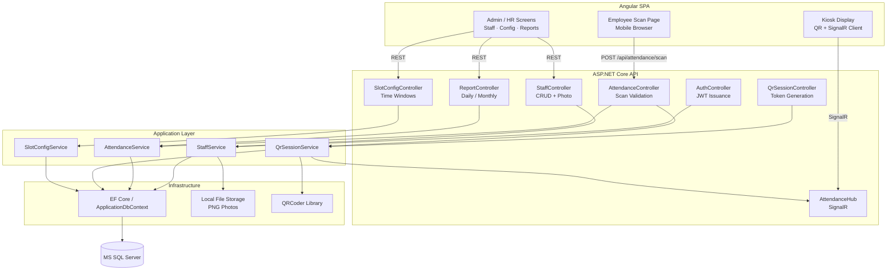
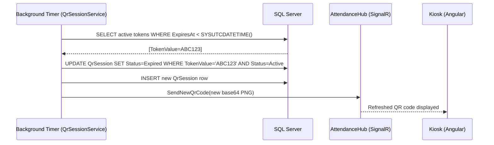
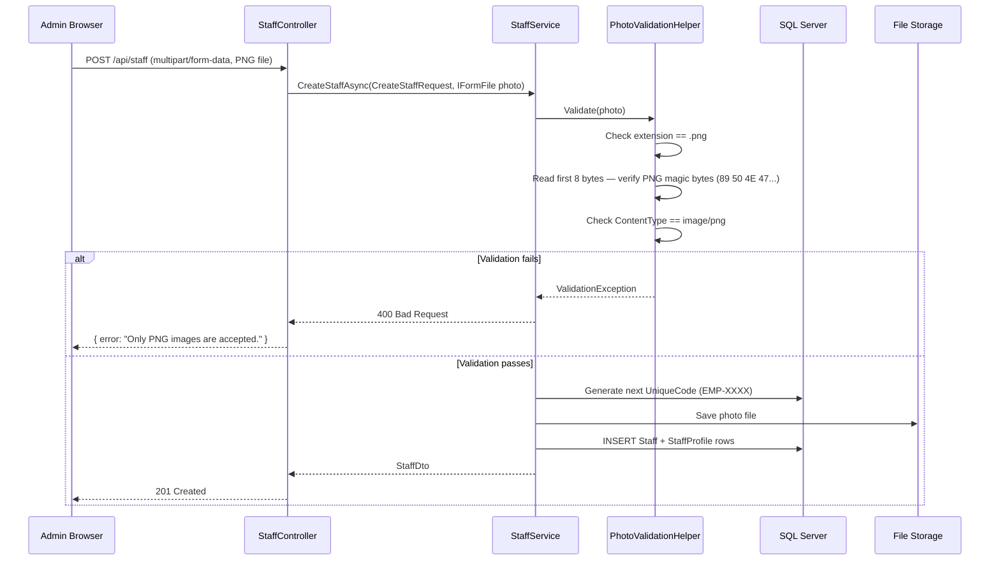

# Design Document: QR-Based Employee Attendance Management System

## Overview

This system replaces manual staff presence tracking with a secure, QR-code-driven attendance management platform. Employees scan a continuously-rotating, single-use QR code displayed on a kiosk screen to log their four daily attendance events (morning check-in, lunch check-out, lunch check-in, evening check-out). The solution is built on ASP.NET Core Web API (Clean Architecture) with an Angular SPA frontend, Microsoft SQL Server, and real-time QR refresh via SignalR.

The core anti-fraud mechanism is a server-generated, single-use token embedded in each QR code. The token is not tied to any employee identity — only the authenticated scan request links the token to a staff member. Atomic token consumption via a conditional database UPDATE prevents any race condition where two simultaneous scan attempts could both succeed on the same token.

## Architecture



## Sequence Diagrams

### QR Code Scan Flow (Core Flow)

```mermaid
sequenceDiagram
    participant Kiosk as Kiosk (Angular)
    participant Hub as AttendanceHub (SignalR)
    participant Phone as Employee Phone (Angular)
    participant API as AttendanceController
    participant QrSvc as QrSessionService
    participant AttSvc as AttendanceService
    participant DB as SQL Server

    Hub-->>Kiosk: Push QR image (TokenValue=ABC123)
    Note over Kiosk: Displays QR; employee scans

    Phone->>API: POST /api/attendance/scan { token: 'ABC123' }
    API->>QrSvc: ValidateAndConsumeAsync('ABC123')
    QrSvc->>DB: UPDATE QrSession SET Status=Used WHERE TokenValue='ABC123' AND Status=Active
    DB-->>QrSvc: 1 row affected (atomic success)
    QrSvc-->>API: Token valid, session info
    API->>AttSvc: RecordAttendanceAsync(staffId, tokenSessionId)
    AttSvc->>DB: Determine slot from current UTC time vs SlotConfig
    AttSvc->>DB: INSERT AttendanceLog(StaffId, SlotId, QrSessionId, StatusFlag)
    DB-->>AttSvc: Log row created
    AttSvc-->>API: AttendanceRecordDto
    API->>QrSvc: GenerateNewTokenAsync()
    QrSvc->>DB: INSERT QrSession(new GUID, ExpiresAt=now+15s)
    QrSvc->>Hub: SendNewQrCode(base64 PNG)
    Hub-->>Kiosk: New QR image displayed
    API-->>Phone: 200 OK { message: "Good morning, John — Get-In recorded at 08:03 AM" }
```

### Token Expiry Auto-Refresh Flow



### Staff Registration with Photo Upload



## Components and Interfaces

### Backend — Application Layer Interfaces

```csharp
// Staff management
interface IStaffService {
    Task<StaffDto> CreateStaffAsync(CreateStaffRequest request, IFormFile photo);
    Task<StaffDto> UpdateStaffAsync(int staffId, UpdateStaffRequest request);
    Task DeactivateStaffAsync(int staffId);       // soft delete
    Task<StaffDto> GetByIdAsync(int staffId);
    Task<PagedResult<StaffDto>> GetAllAsync(StaffFilterRequest filter);
}

// QR session lifecycle
interface IQrSessionService {
    Task<QrCodeResponseDto> GenerateNewTokenAsync();
    Task<QrSessionConsumeResult> ValidateAndConsumeAsync(Guid tokenValue);
    Task ExpireStaleTokensAsync();                // called by background timer
}

// Attendance event recording
interface IAttendanceService {
    Task<AttendanceRecordDto> RecordAttendanceAsync(int staffId, int qrSessionId);
    Task<DailyAttendanceSheet> GetDailySheetAsync(int staffId, DateOnly date);
    Task<MonthlySummary> GetMonthlySummaryAsync(int? staffId, int? departmentId, int year, int month);
    Task<byte[]> ExportDailyReportAsync(DateOnly date, ExportFormat format);
    Task<byte[]> ExportMonthlyReportAsync(int year, int month, ExportFormat format);
}

// Time slot configuration
interface ISlotConfigService {
    Task<SlotConfigDto> CreateSlotAsync(CreateSlotRequest request);
    Task<SlotConfigDto> UpdateSlotAsync(int slotId, UpdateSlotRequest request);
    Task<IEnumerable<SlotConfigDto>> GetAllSlotsAsync();
    AttendanceSlotConfig? ResolveSlotForTime(TimeOnly currentTime, IEnumerable<AttendanceSlotConfig> slots);
}

// File storage abstraction
interface IFileStorageHelper {
    Task<string> SavePhotoAsync(IFormFile file, string staffCode);
    void DeletePhoto(string filePath);
}
```

### Backend — Key DTOs

```csharp
record CreateStaffRequest(
    string FullName, string Gender, DateOnly DateOfBirth,
    string PhoneNumber, string Email, int DepartmentId,
    string JobTitle, DateOnly EmploymentDate,
    string? Address, string? EmergencyContact
);

record StaffDto(
    int StaffId, string UniqueCode, string FullName,
    string Department, string JobTitle, int Status,
    string? PhotoUrl
);

record ScanRequestDto(Guid Token);

record AttendanceRecordDto(
    string StaffName, string SlotName,
    DateTime EventTimestamp, string StatusLabel,  // "On Time" | "Late"
    string GreetingMessage
);

record QrCodeResponseDto(Guid TokenValue, string QrImageBase64, DateTime ExpiresAt);

record SlotConfigDto(
    int SlotId, string SlotName, TimeOnly StartTime, TimeOnly EndTime,
    int GracePeriodMinutes, bool IsMandatory, bool IsActive
);
```

### Frontend — Angular Module Structure

**Responsibilities:**

- `core/AuthService` — stores/refreshes JWT, exposes `currentUser$`
- `core/ApiInterceptor` — attaches `Authorization: Bearer <token>` to every outbound request
- `core/ErrorHandlerService` — maps HTTP error shapes to user-friendly toasts
- `shared/PhotoUploadComponent` — file input restricted to `.png` (HTML `accept` + client-side MIME check before upload)
- `features/kiosk/KioskComponent` — full-screen, establishes SignalR connection, renders live QR image, no manual interaction
- `features/scan/ScanConfirmComponent` — mobile-optimized, posts scan token, shows greeting/error
- `features/staff/StaffFormComponent` — reactive form for create/edit with PNG-only photo picker
- `features/attendance-config/SlotConfigComponent` — admin CRUD for four time-slot definitions
- `features/reports/DailyReportComponent` / `MonthlyReportComponent` — data tables with Excel/PDF export

## Data Models

### SQL Server Schema

```sql
-- Department
CREATE TABLE Department (
    DepartmentId   INT IDENTITY(1,1) PRIMARY KEY,
    DepartmentName NVARCHAR(100) UNIQUE NOT NULL,
    IsActive       BIT NOT NULL DEFAULT 1
);

-- Staff (core identity)
CREATE TABLE Staff (
    StaffId        INT IDENTITY(1,1) PRIMARY KEY,
    UniqueCode     NVARCHAR(20) UNIQUE NOT NULL,   -- EMP-0001
    FullName       NVARCHAR(150) NOT NULL,
    Gender         NVARCHAR(10),
    DateOfBirth    DATE,
    PhoneNumber    NVARCHAR(20),
    Email          NVARCHAR(150) UNIQUE,
    DepartmentId   INT NOT NULL REFERENCES Department(DepartmentId),
    JobTitle       NVARCHAR(100),
    EmploymentDate DATE NOT NULL,
    Status         TINYINT NOT NULL DEFAULT 1,     -- 1=Active, 0=Inactive
    CreatedAt      DATETIME2 NOT NULL DEFAULT SYSUTCDATETIME()
);

-- StaffProfile (extended + photo)
CREATE TABLE StaffProfile (
    StaffProfileId  INT IDENTITY(1,1) PRIMARY KEY,
    StaffId         INT UNIQUE NOT NULL REFERENCES Staff(StaffId),
    PhotoFileName   NVARCHAR(255) NOT NULL,
    PhotoContentType NVARCHAR(50) NOT NULL CHECK (PhotoContentType = 'image/png'),
    PhotoPath       NVARCHAR(400) NOT NULL,
    Address         NVARCHAR(250),
    EmergencyContact NVARCHAR(100)
);

-- Attendance slot configuration
CREATE TABLE AttendanceSlotConfig (
    SlotId             INT IDENTITY(1,1) PRIMARY KEY,
    SlotName           NVARCHAR(50) NOT NULL,  -- MorningIn|LunchOut|LunchIn|EveningOut
    StartTime          TIME NOT NULL,
    EndTime            TIME NOT NULL,
    GracePeriodMinutes INT NOT NULL DEFAULT 0,
    IsMandatory        BIT NOT NULL DEFAULT 1,
    IsActive           BIT NOT NULL DEFAULT 1
);

-- QR session tokens
CREATE TABLE QrSession (
    QrSessionId    INT IDENTITY(1,1) PRIMARY KEY,
    TokenValue     UNIQUEIDENTIFIER UNIQUE NOT NULL DEFAULT NEWID(),
    GeneratedAt    DATETIME2 NOT NULL DEFAULT SYSUTCDATETIME(),
    ExpiresAt      DATETIME2 NOT NULL,
    Status         TINYINT NOT NULL,   -- 0=Active, 1=Used, 2=Expired
    UsedByStaffId  INT REFERENCES Staff(StaffId),
    UsedAt         DATETIME2
);

-- Attendance events
CREATE TABLE AttendanceLog (
    AttendanceLogId BIGINT IDENTITY(1,1) PRIMARY KEY,
    StaffId         INT NOT NULL REFERENCES Staff(StaffId),
    SlotId          INT NOT NULL REFERENCES AttendanceSlotConfig(SlotId),
    QrSessionId     INT REFERENCES QrSession(QrSessionId),
    EventTimestamp  DATETIME2 NOT NULL DEFAULT SYSUTCDATETIME(),
    EventDate       DATE NOT NULL,
    StatusFlag      TINYINT NOT NULL,  -- 0=OnTime, 1=Late, 2=ManualEntry
    CONSTRAINT UQ_AttLog_Staff_Slot_Date UNIQUE (StaffId, SlotId, EventDate)
);

-- Indexes
CREATE NONCLUSTERED INDEX IX_AttLog_Date_Staff ON AttendanceLog(EventDate, StaffId);
CREATE UNIQUE INDEX UX_QrSession_Token ON QrSession(TokenValue);
CREATE UNIQUE INDEX UX_Staff_Code ON Staff(UniqueCode);
CREATE FILTERED INDEX FX_QrSession_Active ON QrSession(Status) WHERE Status = 0;
```

**Validation Rules:**

- `PhotoContentType` is constrained at DB level to `image/png`; additionally enforced in application layer via magic-byte inspection
- `QrSession.Status` transitions: `Active(0) → Used(1)` (by scan), `Active(0) → Expired(2)` (by timer); transitions are one-way
- `AttendanceLog` unique constraint `(StaffId, SlotId, EventDate)` prevents duplicate entries per slot per day
- `UniqueCode` format enforced in application layer: `EMP-` prefix + zero-padded 4-digit sequence

## Algorithmic Pseudocode

### Algorithm 1: ValidateAndConsumeToken (Race-Condition-Safe)

```pascal
PROCEDURE ValidateAndConsumeAsync(tokenValue: GUID): QrSessionConsumeResult
    INPUT: tokenValue — the GUID scanned from QR code
    OUTPUT: QrSessionConsumeResult (Success | TokenNotFound | TokenAlreadyUsed | TokenExpired)

    SEQUENCE
        -- Single atomic UPDATE; no separate SELECT needed
        rowsAffected ← EXECUTE SQL:
            UPDATE QrSession
            SET    Status = 1 (Used), UsedAt = SYSUTCDATETIME()
            WHERE  TokenValue = tokenValue
            AND    Status     = 0 (Active)
            AND    ExpiresAt  > SYSUTCDATETIME()

        IF rowsAffected = 0 THEN
            -- Check WHY: determine the failure reason for the caller
            session ← SELECT FROM QrSession WHERE TokenValue = tokenValue

            IF session IS NULL THEN
                RETURN TokenNotFound
            ELSE IF session.Status = 1 THEN
                RETURN TokenAlreadyUsed
            ELSE IF session.Status = 2 OR session.ExpiresAt <= NOW() THEN
                RETURN TokenExpired
            END IF
        END IF

        RETURN Success(session)
    END SEQUENCE
END PROCEDURE
```

**Preconditions:**
- `tokenValue` is a valid non-empty GUID
- Database connection is available
- `QrSession` table has a unique index on `TokenValue`

**Postconditions:**
- If `rowsAffected = 1`: exactly one `QrSession` row has `Status=Used`; no other concurrent call can also succeed on the same token
- If `rowsAffected = 0`: the token was not consumed; the caller receives a descriptive failure reason
- The operation is idempotent for retries that arrive after the first success (they receive `TokenAlreadyUsed`)

**Concurrency Guarantee:**
The single conditional UPDATE is atomic at the database engine level. Two concurrent requests carrying the same token will both execute the UPDATE; the database serializes them — exactly one will find `Status=Active` and update 1 row; the other will find `Status=Used` and update 0 rows.

---

### Algorithm 2: RecordAttendanceAsync (Slot Resolution)

```pascal
PROCEDURE RecordAttendanceAsync(staffId: INT, qrSessionId: INT): AttendanceRecordDto
    INPUT: staffId — authenticated employee, qrSessionId — just-consumed session
    OUTPUT: AttendanceRecordDto with greeting message

    SEQUENCE
        now       ← SYSUTCDATETIME()
        today     ← DATE part of now
        currentTime ← TIME part of now

        activeSlots ← SELECT * FROM AttendanceSlotConfig WHERE IsActive = 1

        matchedSlot ← NULL
        FOR each slot IN activeSlots DO
            IF currentTime >= slot.StartTime AND currentTime <= slot.EndTime THEN
                matchedSlot ← slot
                BREAK
            END IF
        END FOR

        IF matchedSlot IS NULL THEN
            RAISE OutsideScheduleException("No attendance slot is currently open.")
        END IF

        -- Duplicate guard (DB unique constraint is the true guard; this is the friendly pre-check)
        existing ← SELECT FROM AttendanceLog
                    WHERE StaffId = staffId AND SlotId = matchedSlot.SlotId AND EventDate = today

        IF existing IS NOT NULL THEN
            RAISE DuplicateAttendanceException("Slot already recorded for today.")
        END IF

        -- Determine on-time vs late
        deadline   ← matchedSlot.StartTime + matchedSlot.GracePeriodMinutes (minutes)
        statusFlag ← IF currentTime <= deadline THEN OnTime(0) ELSE Late(1)

        log ← INSERT INTO AttendanceLog(StaffId, SlotId, QrSessionId, EventTimestamp, EventDate, StatusFlag)
              VALUES (staffId, matchedSlot.SlotId, qrSessionId, now, today, statusFlag)

        staff   ← SELECT FullName FROM Staff WHERE StaffId = staffId
        greeting ← FormatGreeting(staff.FullName, matchedSlot.SlotName, now, statusFlag)

        RETURN AttendanceRecordDto(staff.FullName, matchedSlot.SlotName, now, statusFlag, greeting)
    END SEQUENCE
END PROCEDURE
```

**Preconditions:**
- `staffId` belongs to an active staff member
- `qrSessionId` references a `QrSession` with `Status=Used`
- At least one `AttendanceSlotConfig` covers the current time

**Postconditions:**
- Exactly one `AttendanceLog` row inserted for `(staffId, slot, today)` — DB unique constraint enforces this
- `StatusFlag` correctly reflects whether the event was within the grace period

---

### Algorithm 3: GenerateNewTokenAsync

```pascal
PROCEDURE GenerateNewTokenAsync(): QrCodeResponseDto
    INPUT: none
    OUTPUT: QrCodeResponseDto (new token + base64 QR image)

    SEQUENCE
        newToken  ← NEWGUID()
        expiresAt ← NOW() + 15 seconds

        INSERT INTO QrSession(TokenValue, GeneratedAt, ExpiresAt, Status)
        VALUES (newToken, NOW(), expiresAt, Active=0)

        qrImageBytes ← QRCoder.GenerateQrCode(newToken.ToString())
        base64Image  ← Convert.ToBase64String(qrImageBytes)

        HUB.SendAsync("ReceiveQrCode", base64Image, newToken, expiresAt)

        RETURN QrCodeResponseDto(newToken, base64Image, expiresAt)
    END SEQUENCE
END PROCEDURE
```

**Preconditions:**
- Database is reachable
- SignalR hub has at least one connected kiosk client (if not, token is still stored; kiosk will receive it on reconnect via initial load)

**Postconditions:**
- New `QrSession` row exists with `Status=Active`
- All connected kiosk clients receive the new QR image
- Previous active tokens are not explicitly expired here (the background timer handles stale cleanup)

---

### Algorithm 4: PNG Magic-Byte Validation

```pascal
PROCEDURE ValidatePhoto(file: IFormFile): ValidationResult
    INPUT: file — uploaded file from multipart form
    OUTPUT: ValidationResult (Valid | Invalid with message)

    SEQUENCE
        IF file IS NULL OR file.Length = 0 THEN
            RETURN Invalid("No file uploaded.")
        END IF

        ext ← Path.GetExtension(file.FileName).ToLower()
        IF ext != ".png" THEN
            RETURN Invalid("Only PNG images are accepted. Received: " + ext)
        END IF

        IF file.ContentType != "image/png" THEN
            RETURN Invalid("MIME type must be image/png.")
        END IF

        -- Read first 8 bytes to verify PNG magic signature
        header ← READ first 8 bytes from file.OpenReadStream()
        pngMagic ← [0x89, 0x50, 0x4E, 0x47, 0x0D, 0x0A, 0x1A, 0x0A]

        IF header != pngMagic THEN
            RETURN Invalid("File content is not a valid PNG image.")
        END IF

        RETURN Valid
    END SEQUENCE
END PROCEDURE
```

**Preconditions:** `file` is a non-null `IFormFile` from an HTTP multipart request

**Postconditions:**
- Returns `Valid` only when extension, MIME type, AND magic bytes all pass
- A renamed JPG or other non-PNG file is rejected at the magic-byte step even if extension/MIME are spoofed

## Key Functions with Formal Specifications

### QrSessionService.ValidateAndConsumeAsync

```csharp
Task<QrSessionConsumeResult> ValidateAndConsumeAsync(Guid tokenValue)
```

**Preconditions:**
- `tokenValue != Guid.Empty`
- Caller is an authenticated employee (JWT verified)

**Postconditions:**
- On `Success`: exactly one `QrSession` row has `Status = Used` for `tokenValue`; `UsedByStaffId` is populated; no second concurrent call can also return `Success` for the same token
- On non-`Success`: `QrSession` row is unchanged

**Loop Invariants:** N/A (single atomic statement, no loops)

---

### AttendanceService.RecordAttendanceAsync

```csharp
Task<AttendanceRecordDto> RecordAttendanceAsync(int staffId, int qrSessionId)
```

**Preconditions:**
- `staffId` is a valid, active `Staff.StaffId`
- `qrSessionId` references a `QrSession` row with `Status = Used`
- Current UTC time falls within an active `AttendanceSlotConfig` window

**Postconditions:**
- Exactly one `AttendanceLog` row exists for `(staffId, resolvedSlot.SlotId, today)`
- `StatusFlag` = `OnTime` iff `currentTime <= slot.StartTime + slot.GracePeriodMinutes`; otherwise `Late`

**Loop Invariants:** Slot-resolution loop terminates because `activeSlots` is finite; at most one slot matches (non-overlapping constraint)

---

### StaffService.CreateStaffAsync

```csharp
Task<StaffDto> CreateStaffAsync(CreateStaffRequest request, IFormFile photo)
```

**Preconditions:**
- `request.Email` is unique in the `Staff` table
- `photo` passes `ValidatePhoto` (extension + MIME + magic bytes)
- `request.DepartmentId` references an existing active `Department`

**Postconditions:**
- New `Staff` row with auto-generated `UniqueCode` matching pattern `EMP-\d{4}`
- New `StaffProfile` row linked to that `Staff` with `PhotoContentType = "image/png"`
- Photo file saved to `FileStorage` at the returned `PhotoPath`

---

### SlotConfigService.ResolveSlotForTime

```csharp
AttendanceSlotConfig? ResolveSlotForTime(TimeOnly currentTime, IEnumerable<AttendanceSlotConfig> slots)
```

**Preconditions:**
- `slots` contains only `IsActive = true` entries
- Slot time windows are non-overlapping (enforced at configuration time)

**Postconditions:**
- Returns the unique slot where `slot.StartTime <= currentTime <= slot.EndTime`, or `null` if none match
- Result is deterministic for any given `currentTime` and `slots` collection

**Loop Invariants:** For all slots checked so far, none have matched; loop terminates when a match is found or collection exhausted

## Error Handling

### Error Scenario 1: Token Not Found

**Condition:** `POST /api/attendance/scan` with a GUID that does not exist in `QrSession`
**Response:** `404 Not Found` — `{ "error": "QR code not recognized." }`
**Recovery:** Employee is shown an error; they should re-scan the current kiosk QR code

### Error Scenario 2: Token Already Used

**Condition:** Two concurrent scan requests for the same token; second request arrives after first has committed
**Response:** `409 Conflict` — `{ "error": "This QR code has already been used. Please scan the new code." }`
**Recovery:** Kiosk has already refreshed to a new QR code by this point; employee scans again

### Error Scenario 3: Token Expired

**Condition:** Employee scans a QR code after the 15-second window has elapsed
**Response:** `410 Gone` — `{ "error": "QR code has expired. Please scan the current code on the kiosk." }`
**Recovery:** Kiosk auto-refreshed the code; employee scans the new one

### Error Scenario 4: Outside Attendance Window

**Condition:** Scan submitted at a time that falls in no active `AttendanceSlotConfig` window
**Response:** `422 Unprocessable Entity` — `{ "error": "No attendance slot is open at this time." }`
**Recovery:** Employee waits for the appropriate time window to open

### Error Scenario 5: Duplicate Attendance

**Condition:** Employee successfully scans for a slot they have already recorded today
**Response:** `409 Conflict` — `{ "error": "You have already checked in for this slot today." }`
**Recovery:** No action needed; original record is preserved

### Error Scenario 6: Invalid Photo Format

**Condition:** Admin uploads a non-PNG file during staff registration
**Response:** `400 Bad Request` — `{ "error": "Only PNG images are accepted." }`
**Recovery:** Admin re-uploads a properly formatted PNG file

### Error Scenario 7: Concurrent Duplicate Slot Attempt

**Condition:** Race condition where two AttendanceLog inserts for same (StaffId, SlotId, EventDate) arrive simultaneously
**Response:** Database unique constraint violation caught, mapped to `409 Conflict`
**Recovery:** First insert wins; second caller receives duplicate error message

## Example Usage

```csharp
// --- Scan flow (controller) ---
[HttpPost("scan")]
[Authorize(Roles = "Employee")]
public async Task<IActionResult> Scan([FromBody] ScanRequestDto dto)
{
    var staffId = int.Parse(User.FindFirstValue(ClaimTypes.NameIdentifier)!);
    var consumeResult = await _qrSessionService.ValidateAndConsumeAsync(dto.Token);

    return consumeResult.Status switch {
        ConsumeStatus.Success =>
            Ok(await _attendanceService.RecordAttendanceAsync(staffId, consumeResult.SessionId)),
        ConsumeStatus.TokenNotFound =>
            NotFound(new { error = "QR code not recognized." }),
        ConsumeStatus.TokenAlreadyUsed =>
            Conflict(new { error = "This QR code has already been used. Please scan the new code." }),
        ConsumeStatus.TokenExpired =>
            StatusCode(410, new { error = "QR code has expired. Please scan the current code." }),
        _ => BadRequest()
    };
}

// --- Kiosk Angular component (TypeScript) ---
@Component({ selector: 'app-kiosk', template: `
  <div class="kiosk-fullscreen">
    
    <p>Scan with your mobile device to record attendance</p>
  </div>`
})
export class KioskComponent implements OnInit, OnDestroy {
  qrImageSrc = '';
  private hubConnection!: HubConnection;

  async ngOnInit() {
    this.hubConnection = new HubConnectionBuilder()
      .withUrl('/hubs/attendance', { accessTokenFactory: () => this.authService.getToken() })
      .withAutomaticReconnect()
      .build();

    this.hubConnection.on('ReceiveQrCode', (base64Png: string) => {
      this.qrImageSrc = `data:image/png;base64,${base64Png}`;
    });

    await this.hubConnection.start();
    // Request initial QR on connect
    await this.hubConnection.invoke('RequestCurrentQr');
  }

  ngOnDestroy() { this.hubConnection.stop(); }
}
```

## Testing Strategy

### Unit Testing Approach

Focus unit tests on the pure logic layer in `Attendance.Application`:

- `QrSessionService` — token validation state-machine logic, token generation, expiry detection
- `AttendanceService` — slot resolution for various time values, grace-period boundary cases, status-flag assignment
- `StaffService` — `UniqueCode` generation sequence, photo validation delegation
- `PhotoValidationHelper` — magic-byte checks with valid PNG, JPEG, GIF, and renamed JPEG files
- `SlotConfigService.ResolveSlotForTime` — boundary values (exactly at start/end times, one second before/after)

Test framework: **xUnit** with **Moq** for repository mocks.

### Property-Based Testing Approach

**Property Test Library**: fast-check (used in Angular unit tests) and FsCheck (used in .NET unit tests)

Focus properties on:
- Token consumption atomicity simulation (multiple concurrent calls → exactly one Success)
- Round-trip serialization of DTOs to/from JSON
- Slot resolution: for any time within a slot's window, the correct slot is always returned
- Grace-period status: for any event time ≤ deadline, status is always OnTime; for any time > deadline, status is always Late

### Integration Testing Approach

- API integration tests using `WebApplicationFactory<Program>` against an in-memory or test SQL Server database
- Verify the full scan flow end-to-end: token generation → scan → log insertion → new token push
- Verify duplicate scan rejection via the unique constraint
- Verify photo upload rejection with non-PNG bytes

## Performance Considerations

- The filtered index `FX_QrSession_Active` (WHERE Status = 0) ensures the atomic UPDATE scan is fast even with large historical token volume
- `AttendanceLog(EventDate, StaffId)` index supports daily report queries efficiently
- SignalR hub connections are lightweight (kiosk is typically 1–5 concurrent connections)
- Token expiry background service runs every 5 seconds; it only processes tokens where `ExpiresAt < NOW() AND Status = Active`, touching at most 1–2 rows per cycle
- Report exports use streaming to avoid loading entire month's data into memory at once

## Security Considerations

- JWT tokens are short-lived (15-minute access token + refresh token rotation)
- The QR token encodes no personal data — a stolen QR image reveals only a GUID usable once within 15 seconds
- PNG magic-byte validation prevents executable file upload via the photo field
- CORS policy restricts API calls to the Angular origin only
- Role-based authorization guards all admin/HR endpoints; employees cannot access configuration or other staff records
- `HTTPS` enforced in production via HSTS headers
- Serilog logs every scan attempt (success and failure) with `StaffId`, `TokenValue`, and `IP` for audit trail

## Dependencies

**Backend:**
- `Microsoft.AspNetCore.SignalR` — real-time QR push to kiosk
- `QRCoder` (NuGet) — QR image generation
- `Microsoft.EntityFrameworkCore.SqlServer` — ORM + migrations
- `Microsoft.AspNetCore.Identity.EntityFrameworkCore` — user/role management
- `FluentValidation.AspNetCore` — DTO validation
- `AutoMapper` — entity ↔ DTO mapping
- `Serilog.AspNetCore` — structured logging
- `ClosedXML` — Excel export
- `iTextSharp` or `PdfSharpCore` — PDF export

**Frontend:**
- `@microsoft/signalr` — SignalR client
- `@angular/material` or `PrimeNG` — UI components
- `rxjs` — reactive state management
- `xlsx` / file-saver — client-side export (optional, prefer server-side)

## Correctness Properties

*A property is a characteristic or behavior that should hold true across all valid executions of a system — essentially, a formal statement about what the system should do. Properties serve as the bridge between human-readable specifications and machine-verifiable correctness guarantees.*

### Property 1: Token Single-Use Guarantee

*For any* QR session token that is in `Active` state, at most one call to `ValidateAndConsumeAsync` can return `Success`; all subsequent calls for the same token must return `TokenAlreadyUsed` or `TokenExpired`. This covers concurrent scenarios where two requests race on the same token — exactly one must win.

**Validates: Requirements 3.3, 3.5, 3.8**

### Property 2: Slot Resolution Correctness

*For any* `TimeOnly` value that falls within a configured, active slot's `[StartTime, EndTime]` window, `ResolveSlotForTime` returns that slot and never returns `null`. For any time value that falls outside all active slot windows, `ResolveSlotForTime` returns `null` and the scan is rejected with a 422 response.

**Validates: Requirements 3.9, 3.11**

### Property 3: Grace-Period Status Consistency

*For any* attendance event recorded at time `t` for a slot with `StartTime` and `GracePeriodMinutes`, the `StatusFlag` is `OnTime` if and only if `t ≤ StartTime + GracePeriodMinutes`; otherwise it is `Late`.

**Validates: Requirements 3.4, 4.1**

### Property 4: PNG Magic-Byte Validation Soundness

*For any* uploaded file, `ValidatePhoto` returns `Valid` if and only if all three conditions hold: (a) extension is `.png`, (b) declared MIME type is `image/png`, AND (c) the first 8 bytes match the PNG magic signature `[0x89,0x50,0x4E,0x47,0x0D,0x0A,0x1A,0x0A]`. Any file failing even one condition is rejected with HTTP 400, regardless of what the other conditions indicate.

**Validates: Requirements 1.3, 1.4, 1.5**

### Property 5: UniqueCode Monotonic Uniqueness

*For any* sequence of staff registrations, no two `Staff` rows share the same `UniqueCode`; every `UniqueCode` matches the pattern `EMP-\d{4}` with a strictly increasing numeric suffix; and a duplicate email address in any registration attempt results in rejection.

**Validates: Requirements 1.1, 1.7, 1.8**

### Property 6: Duplicate Attendance Rejection

*For any* combination of `(StaffId, SlotId, EventDate)`, at most one `AttendanceLog` row exists. Any second scan attempt for the same staff member, slot, and date is rejected with HTTP 409, whether via concurrent requests or sequential attempts.

**Validates: Requirements 3.10, 7.3**

### Property 7: Token State Immutability

*For any* `QrSession` token that has transitioned to `Status = Used` or `Status = Expired`, no subsequent operation can transition it back to `Active` or modify its `UsedAt` timestamp. Token state transitions are strictly one-way: Active → Used (by scan) or Active → Expired (by timer).

**Validates: Requirements 3.3, 3.7**

### Property 8: Report Completeness

*For any* staff member and date, the daily attendance sheet contains exactly one entry per active mandatory slot where a log exists; mandatory slots with no `AttendanceLog` row for that date are represented as `Absent`. Monthly report counts are consistent with the sum of individual daily entries.

**Validates: Requirements 4.1, 4.2, 4.5**

### Property 9: Role-Based Data Isolation

*For any* authenticated Employee user requesting their attendance history, every returned `AttendanceLog` record has a `StaffId` matching that employee's own identifier. An Employee never receives records belonging to another staff member.

**Validates: Requirements 5.4, 5.5**

### Property 10: Slot Config Validation

*For any* `AttendanceSlotConfig` creation or update request where `EndTime ≤ StartTime`, the request is rejected with HTTP 400. Only configurations where `EndTime > StartTime` are persisted.

**Validates: Requirements 2.2, 2.5**
